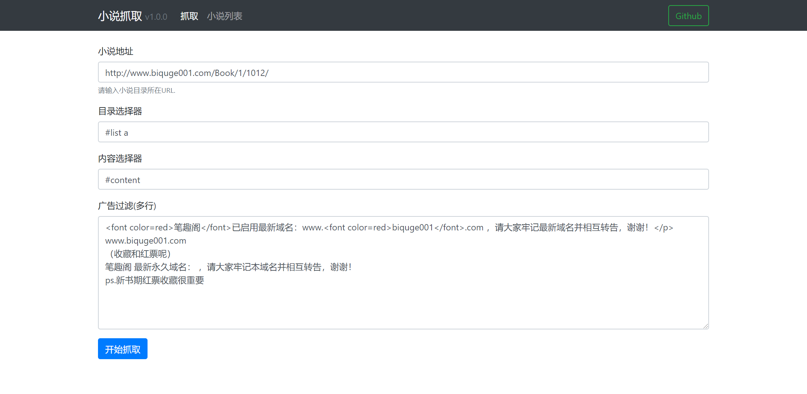
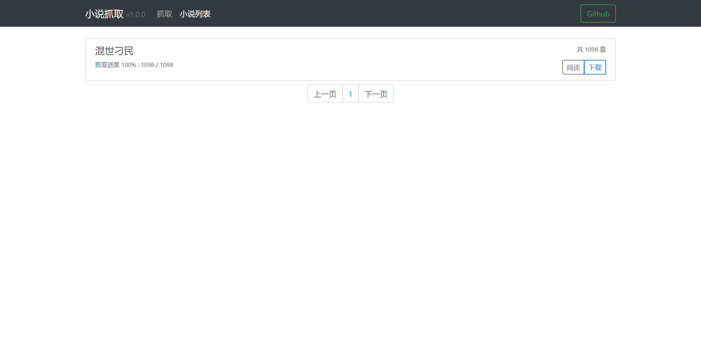

# 小说抓取

根据小说URL和相关的参数，获取小说内容，并支持在线阅读和下载。



# 运行

```bash
git clone https://github.com/DennisGuo/novel-grapper.git
cd novel-grapper
npm install
node server.js
```

浏览器访问：[http://127.0.0.1:3000/](http://127.0.0.1:3000/)

